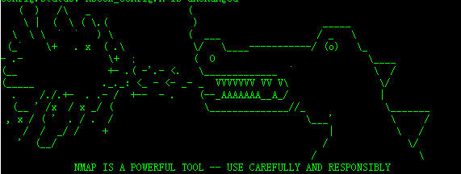

来至: http://nmap.org/book/inst-source.html

```
   (  )   /\   _                 (
    \ |  (  \ ( \.(               )                      _____
  \  \ \  `  `   ) \             (  ___                 / _   \
 (_`    \+   . x  ( .\            \/   \____-----------/ (o)   \_
- .-               \+  ;          (  O                           \____
(__                +- .( -'.- <.   \_____________  `              \  /
(_____            ._._: <_ - <- _- _  VVVVVVV VV V\                \/
  .    /./.+-  . .- /  +--  - .    (--_AAAAAAA__A_/                |
  (__ ' /x  / x _/ (                \______________//_              \_______
 , x / ( '  . / .  /                                  \___'          \     /
    /  /  _/ /    +                                       |           \   /
   '  (__/                                               /              \/
                                                       /                  \
             NMAP IS A POWERFUL TOOL -- USE CAREFULLY AND RESPONSIBLY
```

